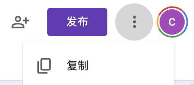
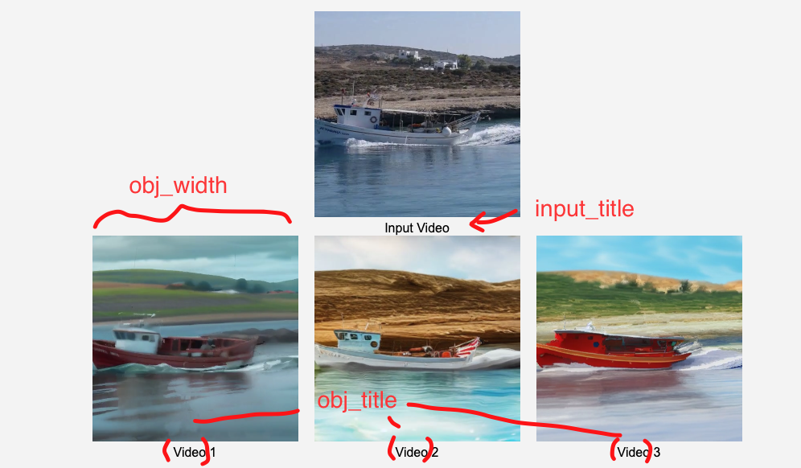
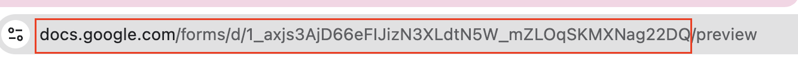
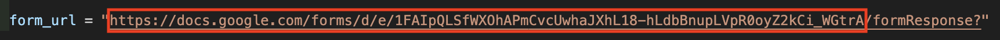
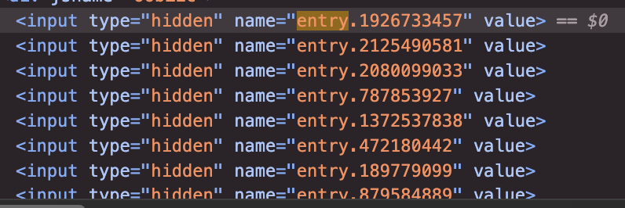
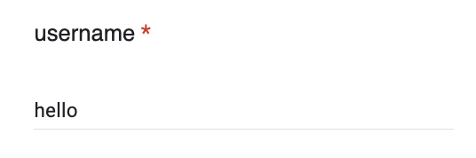
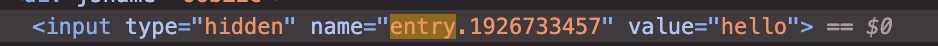

## 使用說明

\*\*注：這裡都有預設的使用方法，如果有特別的使用方法，請自行更改。預設 User study 是 15組，每組是 3 個問題。

#### Step 1: 複製表單

1. 打開表單範本：[表單](https://docs.google.com/forms/d/18yBXuKOFk8XCy2NeepPUiuhdJIylsUyY_xSze_hGnnA/edit)  
2. 點擊右上角三個點後點擊複製  
    
3. 表單預設總共會有 「15組」 比較，每一組會有 「3個」問題，如果需要增加減少要自行調整。

#### Step 2: 修改 Code

1. 打開 index.html  
2. 修改 question list (line 39\)  
   questions \= \[  
              "Question 1",  
              "Question 2",  
              "Question 3"  
          \]  
     
3. 修改 form\_url (line 46)，參考[取得 form\_url](#取得-form_url)。  
4. 檢查 username\_entry 和 entry\_list，我這裡試過直接從範本上複製後 entry id 不會改，如果執行後回答所有問題後回覆有問題的話，可以檢查一下 entry 有沒有問題。檢查方式請看[獲得 entry\_id](#獲得-entry_id)。  
   1. username\_entry: 對應 username 欄位  
   2. entry\_list，每一行對應一組問題，一行會包括一組內的三道問題。

          username\_entry \= "entry.1926733457"

          entry\_list \= \[

              \["entry.2125490581", "entry.2080099033", "entry.787853927"\],

              \["entry.1372537838", "entry.472180442", "entry.189779099"\],

              \["entry.879584889", "entry.1192493797", "entry.592744835"\],

              \["entry.1524869044", "entry.1553191529", "entry.442712978"\],

              \["entry.277023299", "entry.178317512", "entry.1638103689"\],

   

              \["entry.545691709", "entry.2122281902", "entry.1295635086"\],

              \["entry.1324347345", "entry.1468420399", "entry.1830225463"\],

              \["entry.1803416582", "entry.258372846", "entry.1641977658"\],

              \["entry.777412838", "entry.1188271433", "entry.723532485"\],

              \["entry.2051570683", "entry.81840528", "entry.1555251875"\],

   

              \["entry.2059414437", "entry.529442351", "entry.784480663"\],

              \["entry.1766930993", "entry.1316937407", "entry.380261123"\],

              \["entry.1489590171", "entry.1050781807", "entry.63644096"\],

              \["entry.1000678790", "entry.2121748361", "entry.1511438076"\],

              \["entry.500770907", "entry.922414313", "entry.1624512946"\]

          \]

   

5. 調整 line75-78 
```
   input_title = "Input Video"
   obj_title = "Video"
   obj_width = 256
   element_type = "video" // video / image
```
   element\_type 指的是你要顯示的是 image 還是 video。  

6. 修改 data，這裡預設使用此 [File Structure](#file-structure)。如果有特定的指定方式記得從 data\_list 開始修改（data\_list \[0\] 預設是 username)。  
   ![][image4]  
   value 對應的會是最後Google form上面的回答。 
 
7. 最後在網頁中打開 index.html 查看。

## File structure {#file-structure}

method 的 數量可以更改，有幾個放幾個, 預設會將所有 methods 放在同一排，如果太多就自行修改 css。  
```
   \---data  
       |---1  
           |---\<input\>.jpg/mp4  
           |---\<method1\>.jpg/mp4  
           |---\<method2\>.jpg/mp4  
           |---\<method3\>.jpg/mp4  
           |---\<method4\>.jpg/mp4  
       |---2  
           |---\<input\>.jpg/mp4  
           |---\<method1\>.jpg/mp4  
           |---\<method2\>.jpg/mp4  
           |---\<method3\>.jpg/mp4  
           |---\<method4\>.jpg/mp4  
       |---3  
           :  
           :  
           :  
       |---15
```

## Google 表單操作

#### 取得 form\_url {#取得-form_url}

1. 確認表單屬於發布狀態，如果還沒發布就點擊右上角發布  
   
2. 點擊預覽  
   
3. 複製連結到 /preview 前
   
4. 將 /formResponse? 前的連結進行替換, 其實也能指複製 id 替換 id就好。
   


#### 獲得 entry\_id {#獲得-entry_id}

1. 點擊預覽  
   
2. F12, 打開開發者面板  
3. 在 Elements 搜尋 entry  
4. 搜尋到 長這樣的 element, 「name」 後面就是entry id 了
5. 確認問題所對應的 id  
   1. 輸入回答的話，value就會顯示出來  
   2. 

#### 關聯到 google sheet

1. 點擊「回覆」  
2. 點擊「關聯到 Google 表格」
